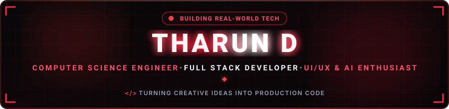
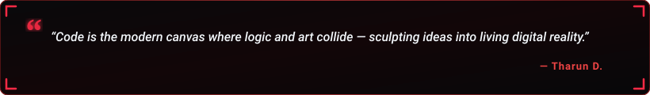

  

  

  
  &nbsp;
  
  &nbsp;
  
  &nbsp;
  
  &nbsp;
  

  

---

<h2 align="center">🔴 About Me</h2>

  

  

  Hey! I'm <b>Tharun D.</b>, a passionate <b>Computer Science Engineering student & developer</b> at <b>Sree Sakthi Engineering College</b> based in <b>Coimbatore, Tamil Nadu, India</b>. 
  I specialize in architecting responsive full-stack web applications, crafting intuitive UI/UX experiences, and deploying machine learning solutions to solve practical real-world problems.

  
  &nbsp;
  
  &nbsp;
  
  &nbsp;
  

  💬 <b>Let's Discuss:</b> Python, JavaScript, HTML, CSS, UI/UX Design, MongoDB, REST APIs, Git & Modern Web Architecture. 
  ⚡ <b>Philosophy:</b> <i>"I love turning creative ideas and design concepts into fully deployed production software!"</i>

<table width="100%" border="0" align="center">
<tr>
<td width="50%" align="center" style="padding: 14px;">
  <h4>🔭 Flagship Project</h4>
  
<a href="https://portfolio-kappa-teal-73.vercel.app/" target="_blank"><b>Solvex — Smart Education App</b></a> Intelligent Learning Tools & Student Workflows

</td>
<td width="50%" align="center" style="padding: 14px;">
  <h4>🌱 Active Deep Dives</h4>
  
<b>Full-Stack Development</b> Python, REST APIs & UI/UX Systems in Figma

</td>
</tr>
<tr>
<td width="50%" align="center" style="padding: 14px;">
  <h4>🎯 Career Goal</h4>
  
<b>Full-Stack Developer</b> Crafting High-Performance User Experiences

</td>
<td width="50%" align="center" style="padding: 14px;">
  <h4>🤝 Collaboration</h4>
  
<b>Web, UI/UX & AI/ML</b> Open to exciting new projects & internships

</td>
</tr>
</table>

---

<h2 align="center">🔴 Featured Project Spotlight</h2>

<table width="100%" border="0" align="center">
<tr>
<td align="center" style="padding: 22px;">
  <h3>💡 Solvex — Smart Education App</h3>
  
<i>An innovative smart education platform designed to assist students with intuitive learning tools, intelligent workflow automation, and enhanced academic problem solving.</i>

   
  

    
    &nbsp;&nbsp;
    
  

</td>
</tr>
</table>

---

<h2 align="center">🛠️ Tech Stack & Skills</h2>

<b>Core Programming Languages</b>

  

<b>Frontend & UI/UX Design</b>

  

<b>Backend & Databases</b>

  

<b>Tools, Version Control & Workflow</b>

  

  
  &nbsp;
  
  &nbsp;
  
  &nbsp;
  

---

<h2 align="center">📊 GitHub Analytics & Activity</h2>

  
  &nbsp;&nbsp;
  

  

  

---

<h2 align="center">⚡ Contribution Journey</h2>

  

---

<h2 align="center">📬 Let's Connect &amp; Collaborate</h2>

<i>Whether you want to discuss full-stack projects, UI/UX design, or explore internship and collaboration opportunities — my inbox is always open!</i>

<table border="0" align="center">
<tr>
<td align="center" width="220" style="padding: 16px;">
  <a href="https://www.linkedin.com/in/tharun-d-b84b56364/" target="_blank">
    
      
    
  </a>
   
  <b>Professional Network</b>
</td>
<td align="center" width="220" style="padding: 16px;">
  <a href="https://portfolio-kappa-teal-73.vercel.app/" target="_blank">
    
      
    
  </a>
   
  <b>Projects &amp; Live Demos</b>
</td>
<td align="center" width="220" style="padding: 16px;">
  <a href="mailto:tharund448@gmail.com">
    
      
    
  </a>
   
  <b>Direct Collaboration</b>
</td>
</tr>
</table>

  

